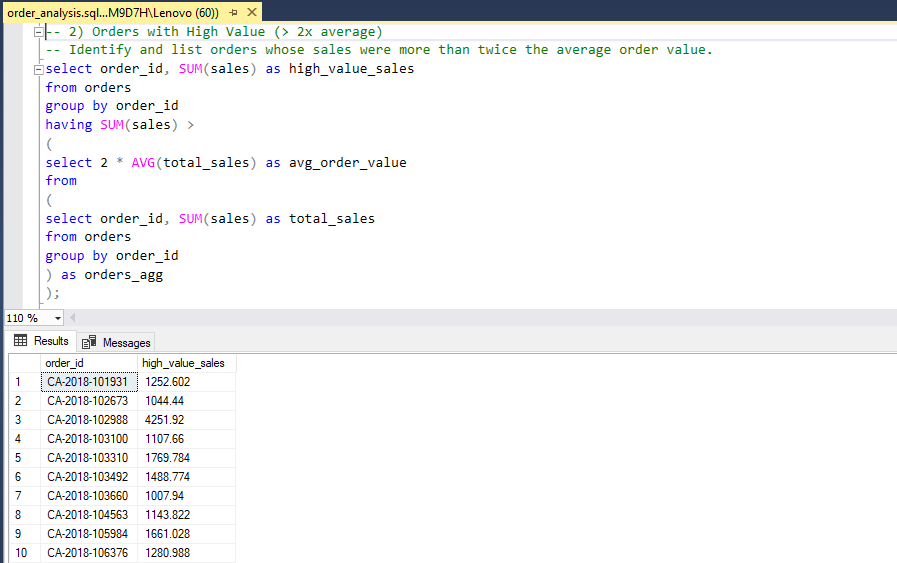

# Superstore Data Analysis SQL Project

## 📌 Project Overview

This project is based on the Superstore Orders dataset (~10,000+ records) and is designed to simulate real-world business scenarios. It focuses on analyzing customer behavior, product performance, and order details to enhance SQL fluency through practical, hands-on problem-solving.

## 📊 Tools & Technologies Used
- SQL Server
- Git & GitHub

## 🧠 Approach
1. Created SQL queries to extract insights
2. Documented findings and final recommendations                

## 🧰 SQL Concepts Used
- Aggregate functions: SUM, AVG, COUNT, MAX
- Subqueries
- GROUP BY and HAVING filters
- Use of DISTINCT, ordering, and logical conditions

## 📊 Project Highlights
1. customer_analysis.sql
2. product_analysis.sql
3. order_analysis.sql

## 📈 Key Features
- Top 5 Customers by Total Sales
Identify the most valuable customers based on cumulative sales.
- Customers Who Placed Only One Order
List customers who only made a single distinct order.
- Customers Who Purchased More Units Than the Average
Shows customers who bought more units than the average quantity purchased across all customers.
- Customers With Order Count Above Average
Highlights customers whose order count exceeds the average order count.

## ✅ Results
Summarize key outcomes and impact 
- Identified top 5 customers by total sales to guide loyalty and retention strategies
- Detected customers purchasing more units than the average - potential bulk buyers
- Isolated customers placing orders more frequently than average - ideal for upselling
- Calculated average order value to benchmark transaction sizes
- Listed high-value orders (> 2x average) to track exceptional or VIP transactions
- Found days with highest order volume - aids in staffing and campaign planning
- Highlighted best-selling products in each category for stock optimization
- Identified products with high sales frequency but low revenue - potential pricing inefficiencies
- Flagged products never bought in the Corporate segment - market segmentation gap

## 📸 Screenshots

| Query Output | Screenshot |
|--------------|------------|
| Above Average Quantity Customers |  |
| High Value Orders |  |
| Top Product by Category |  |

## 📚 Learnings
- Writing and optimizing advanced SQL subqueries
- Using GROUP BY and HAVING effectively for aggregated filtering
- Identifying business KPIs from raw transactional data (sales, quantity, frequency)
- Structuring SQL scripts in a modular, portfolio-ready format
- Analyzing customer, product, and order behavior with real-world objectives
- Organizing a GitHub repo with scripts, visuals, and documentation
- Enhancing communication through SQL output screenshots and README storytelling